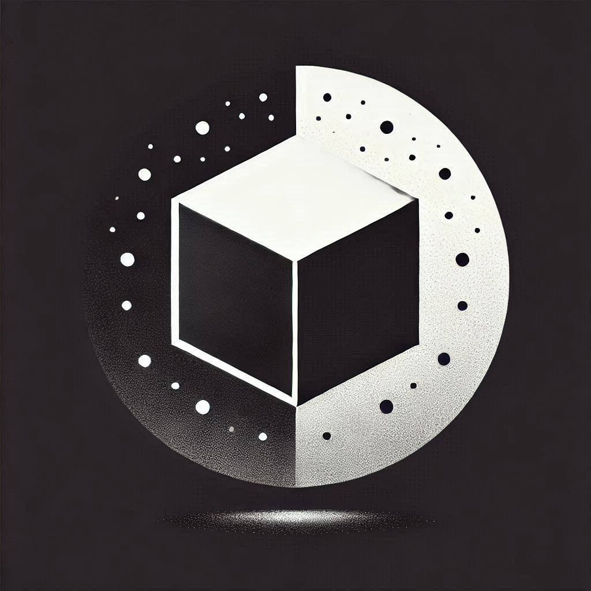

LoFi Square
Um player de rádio web minimalista e elegante para você curtir streams de Lo-Fi, Jazz e muito mais. Focado em uma experiência limpa e relaxante, com um design que remete à imensidão do espaço.



✨ Recursos da Nova Versão
 * Design Minimalista e Espacial: Interface totalmente redesenhada com um tema monocromático (preto e branco) para uma experiência visual limpa e focada.
 * Fundo Animado: Partículas sutis que se movem lentamente, criando uma atmosfera de "céu estrelado" relaxante.
 * Tecnologia Moderna: O layout agora é construído com Tailwind CSS, e toda a aplicação (HTML, CSS e JavaScript) está contida em um único arquivo para simplificar a manutenção.
 * Player de Vidro (Glassmorphism): O card do player utiliza um efeito de vidro fosco para um toque de sofisticação.
 * Instalação como App (PWA): Continue instalando o LoFi Square como um aplicativo leve no seu desktop ou smartphone para acesso rápido.
🚀 Como Adicionar Novas Rádios
Com a nova estrutura, todas as rádios estão diretamente no arquivo index.html. Para adicionar uma nova, siga os passos:
 * Abra o arquivo index.html.
 * Procure pela tag <script> no final do arquivo.
 * Encontre a constante categories.
 * Adicione o link da nova rádio na categoria desejada.

```js
// Exemplo dentro do arquivo index.html

const categories = {
  Ambientes: [
    "https://radio.stereoscenic.com/ama-h", 
    "https://radio.stereoscenic.com/ama-s"
    // Adicione sua nova rádio de ambiente aqui
  ],
  Jazz: [
    "https://icecast.radiofrance.fr/fip-midfi.mp3",
    "https://icecast.radiofrance.fr/fipjazz-midfi.mp3"
     // Adicione sua nova rádio de jazz aqui
  ],
  // ...outras categorias
};
```

💾 Instalação (PWA)
Para a melhor experiência, instale o LoFi Square no seu dispositivo.
Após o carregamento do site, um convite para instalação aparecerá. Ao aceitar, um ícone será adicionado à sua área de trabalho ou tela inicial, funcionando como um aplicativo nativo, mas com um tamanho insignificante.
📜 Histórico de Versões (Changelog)
<details>
<summary>Clique para ver as versões</summary>
<details>
<summary><strong>v2.0.0 (Junho de 2024)</strong></summary>
- Revolução Visual: Migração completa para um novo design com tema espacial, utilizando a tecnologia Tailwind CSS.
- Código Unificado: O HTML, CSS e JavaScript foram unificados no arquivo index.html para simplificar o projeto.
- Melhora de Performance: Animações e efeitos otimizados para uma experiência mais fluida.
</details>
<details>
<summary>v1.0.4 (Janeiro de 2024)</summary>
 * Migração do projeto para a tecnologia PWA, abandonando o executável de 500 MB.
   </details>
<details>
<summary>v1.0.3</summary>
- Correção em imagens da logo.
</details>
<details>
<summary>v1.0.2</summary>
- Layout antigo adicionado.
- Novos streams incluídos.
</details>
<details>
<summary>v1.0.1/0</summary>
- Versão inicial para Web, Windows e Linux.
</details>
</details>
<br>

> [!WARNING]
> Atenção: As versões antigas para Windows, Linux e MacOS foram descontinuadas. O projeto agora vive exclusivamente como um aplicativo web (PWA).
